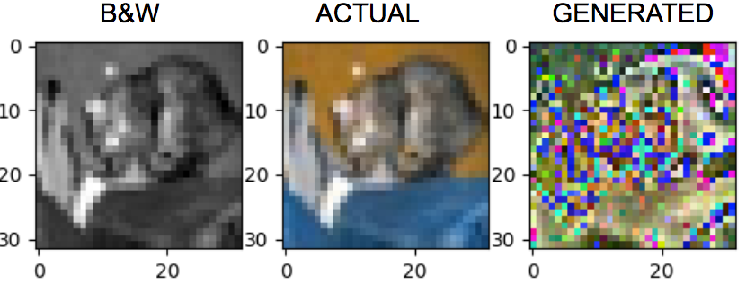
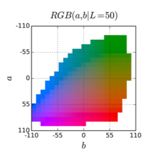
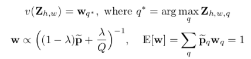
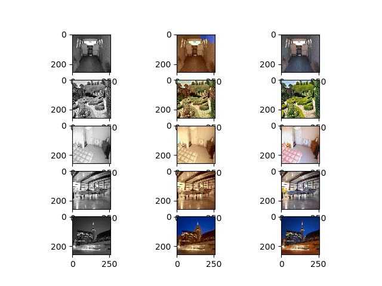
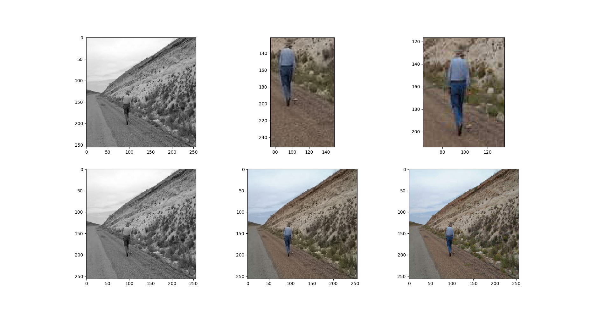
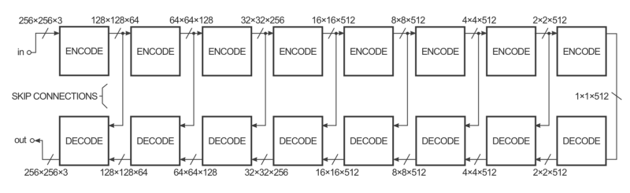
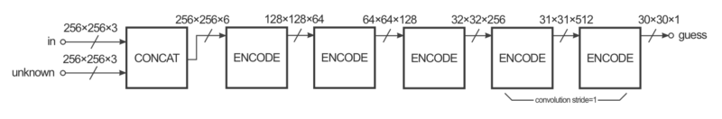
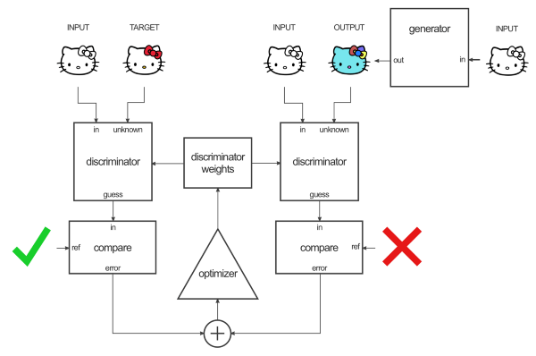
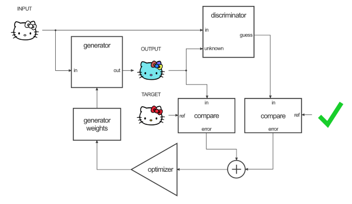
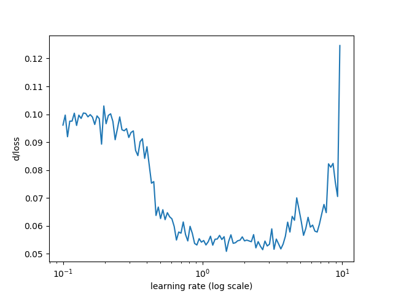

# corolization

AI agent to colorize b&w images

## Motivation

Back in high school, there were plenty of shops which let you hire artists to colour old childhood photographs from an age where camera technology had been much more primitive. Today, the enduring appeal of colour has sparked a [subreddit](https://www.reddit.com/r/Colorization/) dedicated to colorizing black-and-white photos.

Yet it takes an artist a considerable amount of time to colour a black-and-white photograph. Imagine if we had the power to instantaneously transform black-and-white photographs into vibrant, colourful ones - to breathe life into relics, to journey through time! An automated colorizer would also come in handy for enhancing and correcting photos.

Our hope is to create an automated colourizer using deep learning techniques to generate coloured images from black-and-white photos that are reasonably convincing, with the real world as a benchmark.

## The saga of Corolization

This is the story about how our colorizer has evolved over time:

### The rudimentary generator

Our first attempt was to use a generator on the black-and-white image input and generate every pixel of the output image as RGB values. We tested the idea on a simple neural network with multiple fully-connected layers. After about 900 epochs of training, the net seemed to converged and produced the following results

 _Test case from CIFAR-10 dataset_

From the example above, we can see that the neural net has learnt a bit to imitate the general shape of the object in the black-and-white image, although the result is far from "comprehensible" by standards of human vision.

We realised that it is quite tedious to train a "from scratch" generator with the black-and-white input to perform decently. It would be more reasonable to leverage on what we already have as input (black-and-white image) and generate the colour layers. This would require using a colour space that has "lightness" as one of its channels, such as HSL, LUV or Lab, so that the neural net can be trained to output the 2 colour layers, and we would just have to concatenate the lightness layer to get the final image. We decided to try out this approach.

### The "over-generic" colorizer

We were looking for an inspiration when we stumbled on a [blog post](http://tinyclouds.org/colorize/) by [Ryan Dahl](https://github.com/ry). We tried implementing his proposed approach of a residual encoder backed with VGG-16.

As its name suggests, the architecture convolves the input through multiple layers drawn from VGG-16. At the same time, it upscales the output and adds to the previous output for further upscaling. The final output (a pair of UV layers) is then added back to the Y-layer input. There is a huge drawback in terms of resource for this model. It would take several hours to cycle through one epoch of [SUN dataset](https://groups.csail.mit.edu/vision/SUN/). Furthermore, improvement is slow and incremental - after a few epochs of the dataset, we achieved only uniformly sepia-toned outputs. Increasing the number of training epochs produced no further improvement, with desaturated colours hardly convincing to human cognition.

We decided that this approach would be not robust enough and too slow for us to keep re-iterating over the course of the limited timeframe for this project, so we moved on to a new approach.

### The colorful colorizer

After looking around for more inspiration, we settled on a [research idea](http://richzhang.github.io/colorization/) from UC Berkerley's [Rich Zhang](http://richzhang.github.io/). The neural net architecture proposed can be summed up in the diagram below:

The architecture is straightforward - the net takes in the L-layer (in a Lab colour scheme) of an image as input, convolves it through 8 convolutional blocks, generates a probability distribution of colors for each pixel (blue block) and finally outputs the actual pair of ab-layers and upscales them to full-sized color layers.

This approach tackles the problem of desaturated guesses from precedent CNN attempts to colourize photos. Much of the magic lies in the way the loss is formulated. In precedent attempts, the loss functions were calculated as the Euclidean distance between the predicted colour and ground truth colour of each pixel. This means that for any object, the neural network will tend to predict something close to the average range of all the different colour and saturation values for the particular object it has been trained on. For objects that present a wide variety of colours and saturations, this averaging effect tends to favour grayish and desaturated predictions.

In this paper, colorization is treated as a multimodal classification problem. Rather than directly outputting colour values like in other approaches, all possible ab pairs of values are put into 313 different "bins" or categories and converted back to actual colour values during prediction. Training labels are also soft-encoded using the nearest neighbors algorithm based on the colour table shown below.

We implemented this neural net and achieved a decent result after 47 epochs.

-47epoch_vgood.png>)
 _From left to right (input, prediction, actual image)_

Although the result was not much better than that of the residual encoder, training time was reduced significantly. The problem with this approach is that it always predicts general colors. While this works well for objects that tend always to be the same colour such as trees and skies it is unable to accurately predict the colours of non-generic entities, which might present in rare colours. This resulted in neutral-coloured outputs, especially for indoor scenes.

-47epoch_indoor.png>)
 _From left to right (input, prediction, actual image)_

As a result, we drew another technique from the paper called "class rebalancing". For this, we calculate weights for each color bin using the prior distribution of colours from the whole dataset using this formula:

 _q is the color bin, Z is the one-hot label at corresponding pixel_

The idea behind this formula is to reweight the loss of each pixel during the training process by reducing the weightage on colours that appear more frequently and increasing the weightage on rare colours. Training the network through several epochs produced the following results:

 _From left to right (input, prediction, actual image)_

Notwithstanding the fact that it was only trained for a few epochs (which explains why the predictions are not very good), the neural net made more "daring" guesses, resulting in predictions that were more colourful and life-like.

At this point, we discovered yet another problem - the prediction frequently overflows from one object to another. After a long process of investigation which involved overfitting the neural net into one image and observing that the predictions still overflow, we traced the reason to the fact that all parameters had been initialized from a uniform distribution (same starting point!) as the default from PyTorch. We thus changed our initialization method to the Xavier intilization, which produced a very good distinction between objects when overfitted.

 _From left to right (input, prediction, actual image)_

### Bring out the big GAN

Needless to say, we are still not very satisfied with the output from the Colorful
Colorizer. We rethink our approach and hypothesize that a generative approach
might be the way to go.

We decided to give [pix2pix](https://arxiv.org/pdf/1611.07004.pdf) model a try. The
main idea behind pix2pix generative adversarial network, just like other GAN
approach, is to formulate the problem as a game between a "forger" model and a
"detector" model where the "forger" would try to generate as realistic image as
possible while the "detector" would try to segregate fake images from real ones.

Specifically, for the generator, take the input of a b&w image (single channel)
and reduce it with a series of Convolution + Leaky ReLU blocks into smaller
representation, which in turn will produce a higher level representation of data
at the final encoding layer. The decode layers reverse the final encoding back into
images with Transposed Convolution + Leaky ReLU blocks and finally outputting 3 RGB
layers. One advantage of this approach is that the "data-massaging" portion
(for e.g. coverting to LAB colors and extracting different layers) is not needed
anymore, reducing our data loading time down to half compared to previously.
"Skip-connections", where endcoded layers are connected (concatenated) together
with decoded layers, are also utilised to improve the performance of
image-to-image transformation. The general architecture of pix2pix generator can
be summed up as below

For the discriminator, the architecture is straightforward and very much like the
encoder section of the generator, which can be summed up as below

The strategy for training this GAN, similar to other generative adversarial
networks, is a process of alternating between training the discriminator and
generator.

The discriminator will make a guess for each input/target pair of image
(which is taken from either the ground-truth data or the generated results of the
generator) and adjusted its weights based on the error rate.

The generator's weights will then be adjusted based on a combination of the
difference between output vs target image (using L1 loss) and the output of the
discriminator (using binary cross entropy loss).

This model, living up to our expectation of being "the big gun", yields very good
results, attaining our set-out goal of producing human-eyes' believable color
images from grayscales. This is the test results after only 4 epochs on the
SUN2012 dataset:

 _From left to right (input, prediction, actual image)_

## Tuning the "hyper-paradio" (hyper-parameters)

We ultilized a specific technique of plotting traning loss for every batch with different learning rates ([reference](https://towardsdatascience.com/estimating-optimal-learning-rate-for-a-deep-neural-network-ce32f2556ce0)). We plotted multiple ranges of learning rates and from this best plot of learning rates ranging from 0.1 to 10, found the optimal learning rate for our approach to be approximately 0.5 and incorporated it into our training.

## Further improvements

(pending for the slides stuffs on injecting the image classes into the model)

## Technologies

* [PyTorch](http://pytorch.org/) (An awesome, python-first deep learning framework)
* [sk-learn](http://scikit-learn.org/) (Our casual friend)
* [sk-image](http://scikit-image.org/) (Python image magician)

## References

* [Ryan Dahl. "Automatic Colorization". January, 2016](http://tinyclouds.org/colorize/)
* [Xiao, Jianxiong, James Hays, Krista A. Ehinger, Aude Oliva, and Antonio Torralba. "SUN Database: Large-scale Scene Recognition from Abbey to Zoo." 2010 IEEE Computer Society Conference on Computer Vision and Pattern Recognition, 2010. doi:10.1109/cvpr.2010.5539970.](https://groups.csail.mit.edu/vision/SUN/)
* [Zhang, Richard, Phillip Isola, and Alexei A. Efros. "Colorful Image Colorization." Computer Vision – ECCV 2016 Lecture Notes in Computer Science, 2016, 649-66. doi:10.1007/978-3-319-46487-9_40.](https://arxiv.org/pdf/1603.08511.pdf)
* [Isola, Phillip, Jun-Yan Zhu, Tinghui Zhou, and Alexei A. Efros. "Image-to-Image Translation with Conditional Adversarial Networks." 2017 IEEE Conference on Computer Vision and Pattern Recognition (CVPR), 2017. doi:10.1109/cvpr.2017.632.](https://arxiv.org/pdf/1611.07004.pdf)
* [Pavel Surmenok. "Estimating an Optimal Learning Rate For a Deep Neural Network". November 13, 2017](https://towardsdatascience.com/estimating-optimal-learning-rate-for-a-deep-neural-network-ce32f2556ce0)

## Team Members

* Vivek Kalyan
* Teo Si-Yan
* Stanley Nguyen
* Jo Hsi Keong
* Tan Li Xuan

## Acknowledgements

_SUTD 50.035 Computer Vision Instructors and TAs:_

* Prof. Ngai-Man (Man) Cheung
* Prof. Gemma Roig
* Tuan Nguyen Anh Hoang
